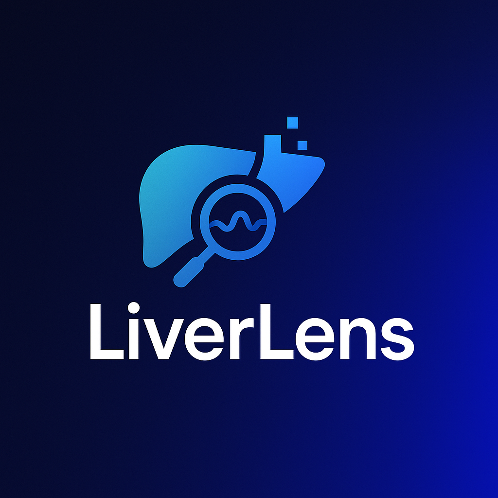
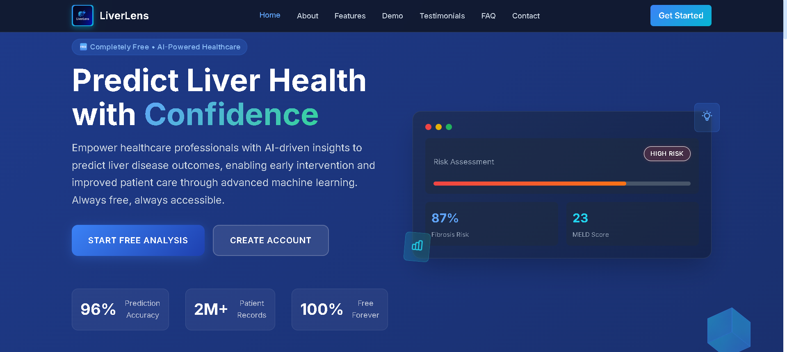
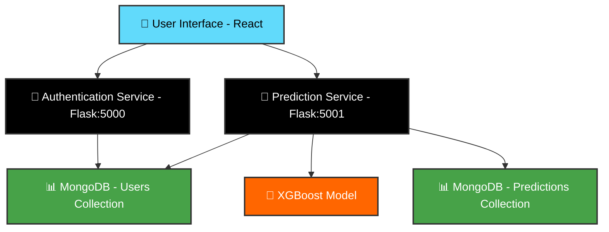

# 🩺 LiverLens - AI-Powered Liver Disease Risk Prediction

<div align="center">
  
  
  
  ### 🚀 Advanced Machine Learning Platform for Liver Disease Risk Assessment
  
  [](https://python.org)
  [](https://reactjs.org)
  [](https://flask.palletsprojects.com)
  [](https://mongodb.com)
  [](https://xgboost.readthedocs.io)
  
  [](https://opensource.org/licenses/MIT)
  [](http://makeapullrequest.com)
  
</div>

---

## 🌟 **Project Overview**

**LiverLens** is a cutting-edge web application that leverages the power of machine learning to predict liver disease risk with **81.2% accuracy**. Designed with healthcare professionals in mind, it provides personalized dashboards, real-time predictions, and comprehensive data analysis tools within a secure, role-based access framework.

<div align="center">
  
  
  
</div>

### 🎯 **Key Highlights**

- 🤖 **Advanced AI Model** - XGBoost with 0.865 ROC AUC score
- 👥 **Multi-Role Support** - Doctors, Researchers, and Students
- 📊 **Real-time Analytics** - Interactive charts and heatmaps
- 🔒 **Enterprise Security** - Role-based access control
- 📱 **Responsive Design** - Works seamlessly across all devices

---

## 🚀 **Features by Role**

<table>
<tr>
<td width="33%">

### 🩺 **Doctor Features**
- 🔍 **Instant Risk Prediction**
- 📋 **Bulk CSV Upload**
- 📄 **PDF Report Generation**
- 📝 **Clinical Notes Integration**
- 💾 **Downloadable Reports**

</td>
<td width="33%">

### 🔬 **Researcher Features**
- 📊 **Dataset Explorer**
- 🔍 **Advanced Filtering**
- 📈 **Feature Distribution**
- 🔥 **Correlation Heatmap**
- 🧠 **SHAP Analysis**
- ⏳ **Temporal Trends**

</td>
<td width="33%">

### 🎓 **Student Features**
- 📚 **Interactive Learning**
- 🖼️ **Visual Case Studies**
- 🤖 **AI Model Explanations**
- 🧪 **Practice Cases**
- 🎯 **Custom Quizzes**

</td>
</tr>
</table>

---

## 🛠️ **Technology Stack**

<div align="center">

### Frontend


### Backend


### Database & ML


</div>

---

## 🧠 **Machine Learning Performance**

<div align="center">

| Metric | Score | Description |
|--------|-------|-------------|
| 🎯 **Accuracy** | **81.2%** | Overall prediction accuracy |
| 📊 **ROC AUC** | **0.865** | Area under the curve |
| 📉 **Log Loss** | **0.40** | Logarithmic loss |

</div>

### 🔬 **Model Architecture**
- **Algorithm**: XGBoost (eXtreme Gradient Boosting)
- **Validation**: StratifiedKFold Cross-validation
- **Optimization**: RandomizedSearchCV hyperparameter tuning
- **Interpretability**: SHAP (SHapley Additive exPlanations)

---

## 📁 **System Architecture**



---

## 🚀 **Quick Start Guide**

### 📋 **Prerequisites**

<table>
<tr>
<td>

**Required Software**
- Python 3.8+
- Node.js 16+
- npm/yarn
- MongoDB 4.4+

</td>
<td>

**Development Tools**
- Git
- VS Code (recommended)
- MongoDB Compass (optional)
- Postman (for API testing)

</td>
</tr>
</table>

### ⚡ **Installation**

1. **📂 Clone the Repository**
   ```bash
   git clone https://github.com/mohrashard/LiverLens.git
   cd LiverLens
   ```

2. **🐍 Backend Setup**
   ```bash
   cd backend
   pip install -r requirements.txt
   ```

3. **⚙️ Environment Configuration**
   ```bash
   # Create .env file
   MONGO_URI=mongodb://localhost:27017/liverlens
   SECRET_KEY=your-secret-key-here
   ```

4. **⚛️ Frontend Setup**
   ```bash
   cd frontend
   npm install
   ```

### 🏃‍♂️ **Running the Application**

<div align="center">

| Service | Command | Port | Status |
|---------|---------|------|--------|
| 🔐 **Auth Backend** | `python register.py` | 5000 | Required |
| 🤖 **ML Backend** | `python prediction.py` | 5001 | Required |
| ⚛️ **Frontend** | `npm start` | 3000 | Required |

</div>

---

## 🎨 **User Interface Preview**

<details>
<summary>🖼️ <strong>View Screenshots</strong></summary>

### Dashboard


### Prediction Interface  


### Analytics Dashboard


</details>

---

## 🔒 **Security Features**

<div align="center">

| Feature | Implementation | Benefit |
|---------|---------------|---------|
| 🛡️ **Role-Based Access** | Flask-Session + MongoDB | Secure user management |
| 🔐 **Password Hashing** | Werkzeug Security | Encrypted password storage |
| 🔑 **Session Management** | Flask SECRET_KEY | Secure authentication |
| 🚫 **Route Protection** | Decorator-based | Unauthorized access prevention |

</div>

---

## 📊 **API Endpoints**

<details>
<summary>📡 <strong>Authentication API (Port 5000)</strong></summary>

```http
POST /register          # User registration
POST /login            # User authentication  
GET  /logout           # Session termination
GET  /profile          # User profile data
```

</details>

<details>
<summary>🤖 <strong>Prediction API (Port 5001)</strong></summary>

```http
POST /predict          # Single prediction
POST /bulk-predict     # Batch predictions
GET  /history          # Prediction history
GET  /analytics        # Data analytics
```

</details>

---

## 🤝 **Contributing**

We welcome contributions from the community! Here's how you can help:

<div align="center">

### 🌟 **Ways to Contribute**

| Type | Description | Getting Started |
|------|-------------|----------------|
| 🐛 **Bug Reports** | Found an issue? Let us know! | [Open an Issue](../../issues) |
| ✨ **Feature Requests** | Have an idea? Share it! | [Request Feature](../../issues) |
| 💻 **Code Contributions** | Want to code? Great! | [Fork & PR](../../pulls) |
| 📚 **Documentation** | Improve our docs | [Edit & Submit](../../pulls) |

</div>

### 📝 **Development Workflow**

1. 🍴 Fork the repository
2. 🌿 Create a feature branch (`git checkout -b feature/AmazingFeature`)
3. 💾 Commit your changes (`git commit -m 'Add some AmazingFeature'`)
4. 📤 Push to the branch (`git push origin feature/AmazingFeature`)
5. 🔄 Open a Pull Request

---

## 📄 **License**

<div align="center">

This project is licensed under the **MIT License** - see the [LICENSE](LICENSE) file for details.

[](https://opensource.org/licenses/MIT)

</div>

---

## 🙏 **Acknowledgments**

<div align="center">

- 🤖 **XGBoost Team** for the incredible ML framework
- 📊 **Kaggle Community** for the liver disease dataset  
- ⚛️ **React Team** for the amazing frontend library
- 🐍 **Flask Community** for the lightweight backend framework
- 🍃 **MongoDB** for the flexible database solution

</div>

---

<div align="center">

### 🌟 **Star this repository if it helped you!**

[](https://github.com/mohrashard/LiverLens/stargazers)
[](https://github.com/mohrashard/LiverLens/network)

---

**Made with ❤️ by the LiverLens Team**

[🏠 Homepage](https://github.com/mohrashard/LiverLens) • [📚 Docs](https://github.com/mohrashard/LiverLens/wiki) • [🐛 Issues](https://github.com/mohrashard/LiverLens/issues) • [💬 Discussions](https://github.com/mohrashard/LiverLens/discussions)

</div>